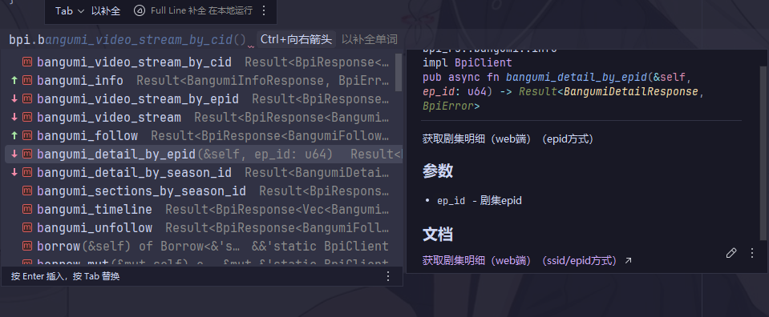

# bpi-rs

🚀 bpi-rs 是一个基于 reqwest
 开发的 Rust 版 Bilibili API SDK，提供了常用的 API 调用封装、账号登录方式以及类型安全的返回值结构。

支持：

✅ 账号登录 / Cookie 登录

✅ 自动 Cookie 管理

✅ 常用 Bilibili API（如番剧信息、用户信息, 视频信息等）

✅ 类型化的响应与错误处理

✅ 支持API: 活动, 专栏, 视频, 直播, 课程, 用户中心, 弹幕, 充电, 笔记, 动态, 搜索, 会员, 登录等等

## ✨ 项目特色

📡 接口覆盖率高：基于官方/社区收集的接口文档，逐步实现了常见的番剧、直播、用户、视频、登录等 API。

✅ 测试全通过：集成测试覆盖主要功能，保证接口调用稳定可靠。

📦 响应结构体清晰：所有 API 返回统一封装的 BpiResponse<T>，并通过 Rust 的强类型系统保证数据安全。

api都是 `分类` + `函数` 便于查找, 比如 `video_info`  `bangumi_coin` `vip_info`, 具体分类可以参考

## 函数调用预览



## 📦 安装

```toml
[dependencies]
bpi-rs = { git = "https://github.com/yuelioi/bpi-rs" }
```

## 🚀 快速开始

```rust
use bpi_rs::{ auth::Account, BpiClient };

#[tokio::main]
async fn main() {
    let bpi = BpiClient::new();

    // 方法1: 直接使用结构体登录
    bpi.set_account(Account {
        dede_user_id: "".to_string(),
        dede_user_id_ckmd5: "".to_string(),
        sessdata: "".to_string(),
        bili_jct: "".to_string(),
        buvid3: "".to_string(),
    });

    // 方法2: 使用cookie字符串登录
    // bpi.set_account_from_cookie_str("dede_user_id=123;bili_jct=456...");

    let result = bpi.bangumi_info(28220978).await;
    match result {
        Ok(resp) => {
            if let Some(data) = resp.data {
                tracing::info!("标题: {}", data.media.title);
                tracing::info!("评分: {}", data.media.rating.score);
            }
        }
        Err(e) => { tracing::error!("{:#?}", e) }
    }

}

```

运行日志示例：

```text
10-10 06:40:04  INFO 开始从账号信息加载cookies...
10-10 06:40:04  INFO 从账号信息加载登录 cookies 完成
10-10 06:40:04  INFO 设置账号信息完成，使用[登录]模式
10-10 06:40:04  INFO 已自动加载测试账号
10-10 06:40:04  WARN 账号信息不完整，使用[游客]模式
10-10 06:40:04  INFO 开始请求 获取剧集基本信息: https://api.bilibili.com/pgc/review/user?media_id=28220978
10-10 06:40:04  INFO 获取剧集基本信息 请求成功，耗时: 181.02ms
10-10 06:40:04  标题: 轻音少女 第一季
10-10 06:40:04  评分: 9.9
```

## 🔑 登录方式

### 1.使用 Account 结构体

```rust
let account = Account {
    dede_user_id: "123".into(),
    dede_user_id_ckmd5: "xxxx".into(),
    sessdata: "xxxx".into(),
    bili_jct: "xxxx".into(),
    buvid3: "xxxx".into(),
};

bpi.set_account(account);
```

### 2.使用 Cookie 字符串

```rust
bpi.set_account_from_cookie_str("DedeUserID=123;SESSDATA=xxxx;bili_jct=xxxx;buvid3=xxxx;");
```

### 3.自行扫码登录

为了保持库的整洁, 不带扫码服务, 可以自行绑定

下面的unwrap 都可以用?代替, 被BpiError封装

```rust
// 发送二维码请求, 拿到url, 可以自行用二维码库绘制
let data = bpi.login_send_qrcode().await.unwrap().into_data().unwrap();
data.qrcode_key;
data.url

// 轮训, 成功后就能拿到cookies
bpi.login_check_qrcode_status(qrcode_key).await.unwrap().into_data().unwrap().cookies
```

## 📡 API 返回值

所有 API 返回统一的结构体 BpiResponse<T>：

```rust
pub struct BpiResponse<T> {
    /// 返回值 0：成功
    pub code: i32,

    /// 业务数据，成功时通常有值
    pub data: Option<T>,

    /// 错误信息
    pub message: String,

    /// 状态
    pub status: bool,
}
```

错误类型使用 BpiError，区分网络错误、HTTP 错误、解析错误、API 错误等：

```rust
pub enum BpiError {
    Network { message: String },
    Http { status: u16 },
    Parse { message: String },
    Api { code: i32, message: String, category: ErrorCategory },
    Authentication { message: String },
    InvalidParameter { field: &'static str, message: &'static str },
}
```

## 📖 示例 API

获取番剧信息

```rust
let resp = bpi.bangumi_info(28220978).await?;
println!("标题: {}", resp.data.unwrap().media.title);
```

## 📝 开发计划

95% 覆盖 除了一些没啥用的, 比如风纪委员投票

还有专属app端的也没做

## 自定义api

如果不满足你的需求, 你可以直接自定义

```rust
use crate::{ BilibiliRequest, BpiClient, BpiError, BpiResponse };
impl BpiClient{
  // ...
}
```

1.有data返回的, 自定义data结构体

```rust
pub async fn some_query(
    &self,
    season_id: u64,
) -> Result<BpiResponse<BangumiSectionResult>, BpiError> {
   self
        .get("https://api.bilibili.com/pgc/web/season/section")
        .query(&[("season_id", season_id.to_string())])
        .send_bpi("获取剧集分集信息")
        .await
}

```

2.无data返回的api

```rust
pub async fn some_action(
        &self,
        id: u64,
) -> Result<BpiResponse<serde_json::Value>, BpiError> {
    self
        .post("https://api.bilibili.com/x/article/like")
        .form(&[("id", id.to_string()),])
        .send_bpi("点赞文章")
        .await
}

```

3.如果需要csrf, 可以直接

```rust
self.csrf()?  // 返回字符串 or BpiError
```

## features

dynamic = ["reqwest/multipart"]
danmaku=["quick-xml","flate2"]
manga = ["zip"]
message = ["uuid"]
misc = [ "hmac", "sha2", "hex"]

## ⚠️ 注意事项

本项目仅用于学习与研究，请勿用于任何违反 B 站服务条款的用途。

## 📄 License

MIT

## 参考

[bilibili-API-collect](https://github.com/SocialSisterYi/bilibili-API-collect)
