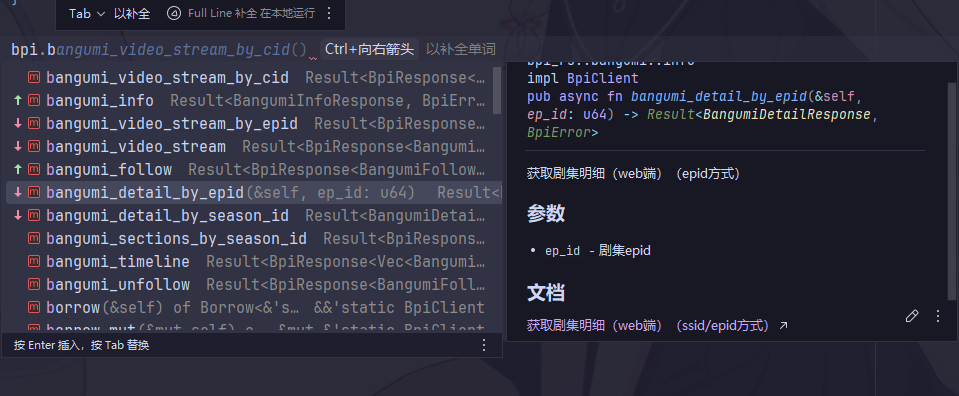
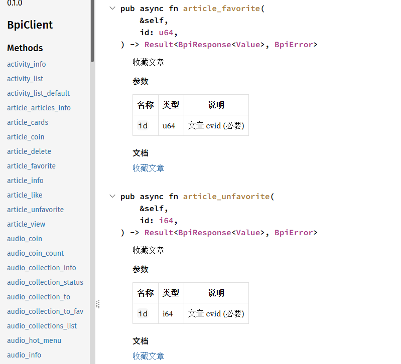

# bpi-rs

> 🦀 基于 [reqwest](https://github.com/seanmonstar/reqwest) 开发的 Rust 版 Bilibili API SDK，提供丰富的 API 封装、多种登录方式与类型安全的返回值结构。

---

## ✨ 项目特色

| 特性               | 说明                                                                |
| ------------------ | ------------------------------------------------------------------- |
| 📡 接口覆盖率高    | 共 322 个 API, 文档给的95%实现                                      |
| ✅ 测试全通过      | 集成测试覆盖主要功能，保证调用稳定可靠                              |
| 🔒 类型安全        | 所有 API 返回统一封装的 `BpiResponse<T>`，Rust 强类型保障数据安全 |
| 🍪 Cookie 自动管理 | 支持 Account 结构体 / Cookie 字符串 / 扫码登录                      |

**支持的功能模块：** 活动、专栏、视频、直播、课程、用户中心、弹幕、充电、笔记、动态、搜索、会员、登录……

---

## 📚 函数文档

API 命名风格为 `分类` + `功能`，便于查找，例如：`video_info`、`bangumi_coin`、`vip_info`。

**IDE 内联提示**



**[cargo 文档](https://docs.rs/bpi-rs/latest/bpi_rs/client/struct.BpiClient.html)**



---

## 📦 安装

```toml
# Cargo.toml
[dependencies]
bpi-rs = "*"
```

或使用 cargo add：

```bash
cargo add bpi-rs
```

---

## 🚀 快速开始

```rust
use bpi_rs::{ auth::Account, BpiClient };

#[tokio::main]
async fn main() {
    let bpi = BpiClient::new();

    // 方法1: 直接使用结构体登录
    bpi.set_account(Account {
        dede_user_id: "".to_string(),
        dede_user_id_ckmd5: "".to_string(),
        sessdata: "".to_string(),
        bili_jct: "".to_string(),
        buvid3: "".to_string(),
    });

    // 方法2: 使用 Cookie 字符串登录
    // bpi.set_account_from_cookie_str("dede_user_id=123;bili_jct=456...");

    let result = bpi.bangumi_info(28220978).await;
    match result {
        Ok(resp) => {
            if let Some(data) = resp.data {
                tracing::info!("标题: {}", data.media.title);
                tracing::info!("评分: {}", data.media.rating.score);
            }
        }
        Err(e) => { tracing::error!("{:#?}", e) }
    }
}
```

**运行日志示例：**

```text
10-10 06:40:04  INFO 开始从账号信息加载cookies...
10-10 06:40:04  INFO 从账号信息加载登录 cookies 完成
10-10 06:40:04  INFO 设置账号信息完成，使用[登录]模式
10-10 06:40:04  WARN 账号信息不完整，使用[游客]模式
10-10 06:40:04  INFO 开始请求 获取剧集基本信息: https://api.bilibili.com/pgc/review/user?media_id=28220978
10-10 06:40:04  INFO 获取剧集基本信息 请求成功，耗时: 181.02ms
10-10 06:40:04  标题: 轻音少女 第一季
10-10 06:40:04  评分: 9.9
```

---

## 🔑 登录方式

### 1. Account 结构体

```rust
bpi.set_account(Account {
    dede_user_id: "123".into(),
    dede_user_id_ckmd5: "xxxx".into(),
    sessdata: "xxxx".into(),
    bili_jct: "xxxx".into(),
    buvid3: "xxxx".into(),
});
```

### 2. Cookie 字符串

```rust
bpi.set_account_from_cookie_str("DedeUserID=123;SESSDATA=xxxx;bili_jct=xxxx;buvid3=xxxx;");
```

### 3. 扫码登录

为保持库的整洁，不内置二维码渲染，可自行绑定：

```rust
// 1. 获取二维码 URL 和 key（可用任意二维码库渲染）
let data = bpi.login_send_qrcode().await?.into_data()?;
println!("扫码地址: {}", data.url);

// 2. 轮询状态，成功后获取 cookies
let cookies = bpi
    .login_check_qrcode_status(data.qrcode_key)
    .await?
    .into_data()?
    .cookies;
```

---

## 📡 API 返回值

所有 API 返回统一结构体 `BpiResponse<T>`：

```rust
pub struct BpiResponse<T> {
    /// 返回码，0 表示成功
    pub code: i32,
    /// 业务数据，成功时通常有值
    pub data: Option<T>,
    /// 错误信息
    pub message: String,
    /// 状态
    pub status: bool,
}
```

错误类型 `BpiError` 细分多种场景：

```rust
pub enum BpiError {
    Network       { message: String },
    Http          { status: u16 },
    Parse         { message: String },
    Api           { code: i32, message: String, category: ErrorCategory },
    Authentication{ message: String },
    InvalidParameter { field: &'static str, message: &'static str },
}
```

---

## 📖 示例 API

```rust
// 获取番剧信息
let resp = bpi.bangumi_info(28220978).await?;
println!("标题: {}", resp.data.unwrap().media.title);
```

---

## 🛠️ 自定义 API

内置 API 不满足需求时，可直接扩展 `BpiClient`：

```rust
use bpi_rs::{ BilibiliRequest, BpiClient, BpiError, BpiResponse };

impl BpiClient {
    // 有 data 返回：自定义 data 结构体
    pub async fn some_query(
        &self,
        season_id: u64,
    ) -> Result<BpiResponse<BangumiSectionResult>, BpiError> {
        self.get("https://api.bilibili.com/pgc/web/season/section")
            .query(&[("season_id", season_id.to_string())])
            .send_bpi("获取剧集分集信息")
            .await
    }

    // 无 data 返回：使用 serde_json::Value
    pub async fn some_action(
        &self,
        id: u64,
    ) -> Result<BpiResponse<serde_json::Value>, BpiError> {
        self.post("https://api.bilibili.com/x/article/like")
            .form(&[("id", id.to_string())])
            .send_bpi("点赞文章")
            .await
    }
}
```

需要 csrf token 时：

```rust
let csrf = self.csrf()?; // 返回字符串，失败则返回 BpiError
```

---

## 🧪 自行开发

如果你想在本地跑测试或二次开发，需要提供真实账号信息：

1. 将 `account.example.toml` 重命名（或复制）为 `account.toml`
2. 打开 B 站并登录，按 `F12` → `Application` → `Cookies`，找到以下字段并填入：

```toml
# account.toml — 本地测试用，请勿提交到版本控制

bili_jct            = "你的 bili_jct"
dede_user_id        = "你的 DedeUserID"
dede_user_id_ckmd5  = "你的 DedeUserID__ckMd5"
sessdata            = "你的 SESSDATA"
buvid3              = "你的 buvid3"
```

> **最重要的字段是 `sessdata`**，大多数需要登录的接口都依赖它。
>
> `account.toml` 已加入 `.gitignore`，不会被意外提交。

---

## 📝 开发计划

- [X] 常用 API 覆盖（322 个）
- [ ] 95% 覆盖率目标（剩余：部分冷门接口、风纪委员投票等）
- [ ] 专属 App 端接口支持

---

## ⚠️ 注意事项

本项目仅用于学习与研究，请勿用于任何违反 B 站服务条款的用途。

---

## 📄 License

[MIT](./LICENSE)

## 参考

[bilibili-API-collect](https://github.com/SocialSisterYi/bilibili-API-collect)
